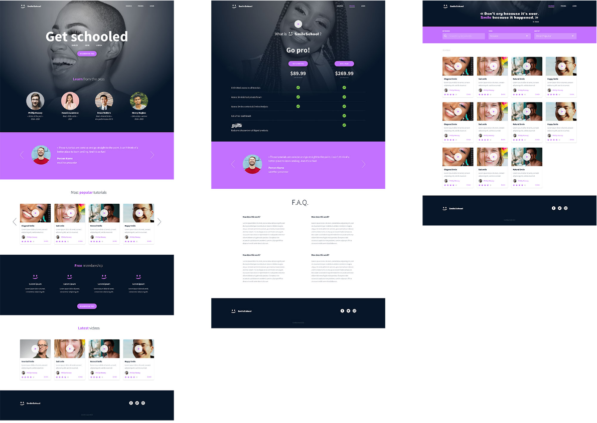
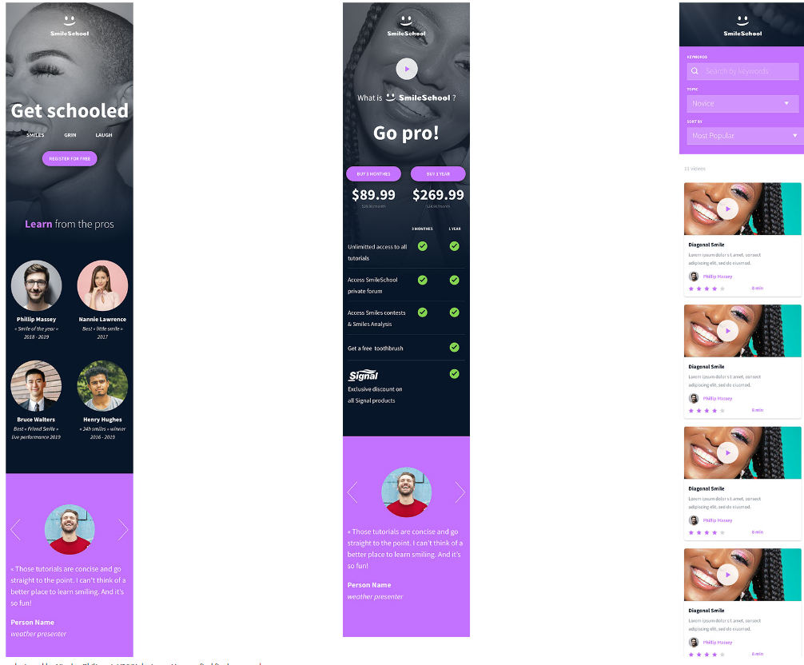

# Implement a design with bootstrap

In this project, you will implement 3 web pages with Bootstrap. You will use all HTML/CSS/Accessibility/Responsive design/Bootstrap knowledges that you learned previously.

You won’t have a lot of instruction, you are free to implement it the way that you want - the objective is simple: Have fully functional web pages that look the same as the designer file.

## Goal

The goal is to recreate a version of this:

#### Important notes with Figma:

+ if your computer doesn’t have missing fonts, you can find them here: source-sans-pro and Spin-Cycle-OT

+ some values are in float - feel free to round them

+ “Be pixel perfect” - yes! but mainly make sure colors, size and position are correct. #C271FF is not purple.

#### Interactions note:

+ Web pages must switch to the tablet version when the screen width is 768px

+ Web pages must switch to the mobile version when the screen width is 576px

+ button hover/active: opacity: 0.9
